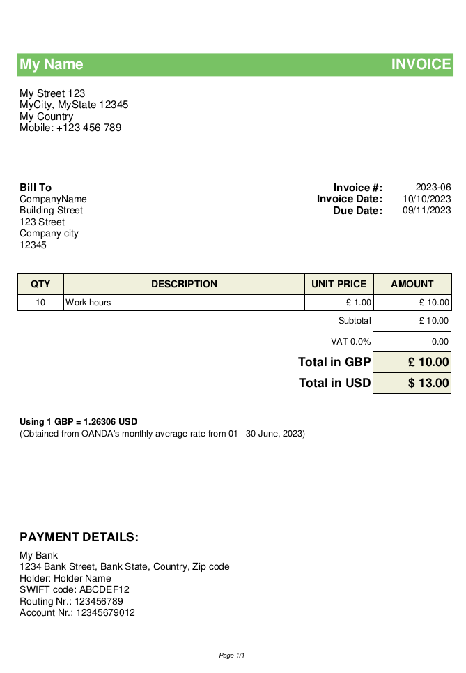
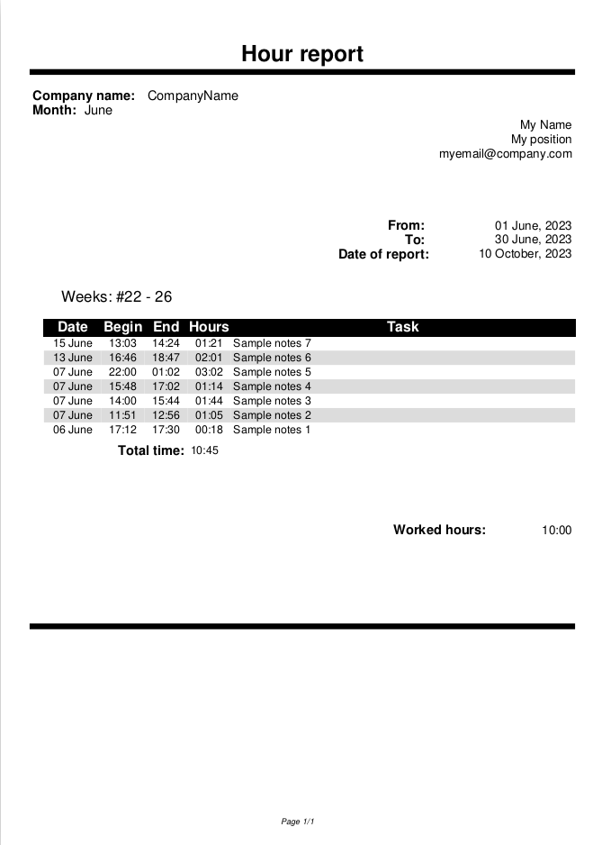
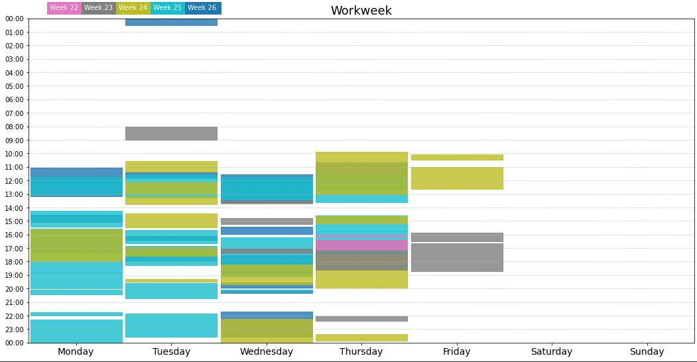

# Work Hour Distribution Visualization

This repository provides a suite of tools designed to visualize work hour distributions for employees. These tools allow users to generate invoices based on work hours and visualize work hours distributed across weekdays.

## Features

- Extract work hours from the 'worklog' app data and convert them into invoice format.
- Generate PDFs of invoices with detailed billing and company information.
- Visualize work hour distribution across weekdays in a visually appealing format.

## Directory Structure

The code uses a predefined directory structure for reading raw data and saving processed information:

- `0-RawData`: Contains raw data extracted from the 'worklog' app.
- `1-Invoices`: This is where the generated invoice PDFs are saved.
- `2-ProcessedHours`: Stores other processed data related to work hours.

```python
RAW_DIRECTORY = os.path.join(os.path.abspath(''),"0-RawData")
PROCESSED_DIRECTORY = os.path.join(os.path.abspath(''),"1-Invoices")
PROCESSED_HOURS_DIRECTORY = os.path.join(os.path.abspath(''),"2-ProcessedHours")
```

## Data Source

The raw data is sourced from the ['worklog'](https://play.google.com/store/apps/details?id=arproductions.andrew.worklog&pcampaignid=web_share) app available on the Google Play Store. You can export your data from the app and place it in the `0-RawData` directory.

## Functions Overview

- `generate_invoice(month, year, gbp_to_usd_rate, pay_rate, company_data={}, employee_data={})`:
  Takes the work hours of a specific month and year for a given company, calculates the total payable amount in both GBP and USD, and then generates a PDF invoice.

- `generate_table_and_save_pdf(df, month, year, gbp_to_usd_rate, usd_pay, company_data={}, employee_data={})`:
  Internal function used by `generate_invoice` to save the invoice as a PDF.

- `plot_weekly_hour_distribution(df)`:
  Visualizes the distribution of work hours for each weekday. The plot displays work hours using color coding based on the week number within the month.

## Requirements

- `numpy`
- `pandas`
- `matplotlib`
- A PDF generation library (the exact library was not specified in the shared code, but it appears to use something similar to FPDF).

## Usage

### Generate Invoice

```python
from your_module import generate_invoice

company_data = {
    "name": "Company ABC",
    ...
}

employee_data = {
    "name": "John Doe",
    ...
}

generate_invoice(month=5, year=2023, gbp_to_usd_rate=1.35, pay_rate=20, company_data=company_data, employee_data=employee_data)
```

### Visualize Work Hours

```python
from your_module import plot_weekly_hour_distribution
import pandas as pd

df = pd.read_csv('path_to_your_data.csv')
plot_weekly_hour_distribution(df)
```

Replace `'path_to_your_data.csv'` with the path to your data file from the 'worklog' app. Ensure the data file contains 'Begin' and 'End' columns representing the start and end times of the work, respectively.

## Sample Output

Below is a screenshot of a sample invoice generated by this tool:




And a sample screenshot of the processed hours:



A sample of the visualization:



## Notes

- Ensure to use the helper functions and global variables as defined in the original script, such as `DAYS` for weekday labels and functions like `get_wk_nb`.

---